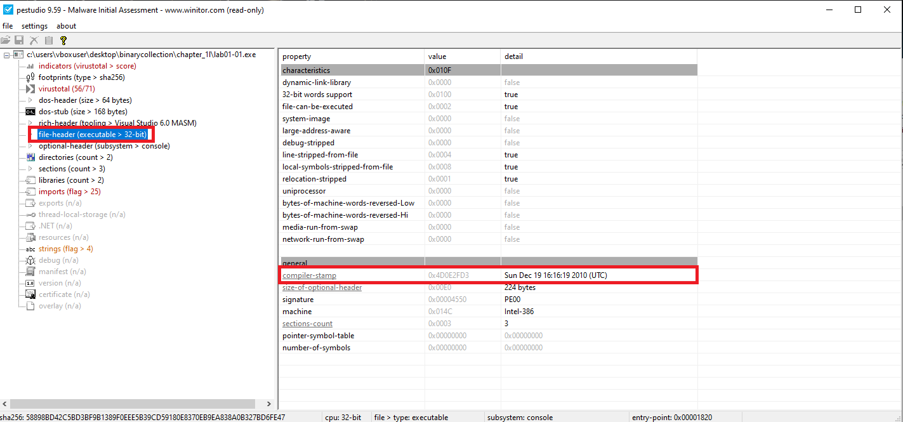
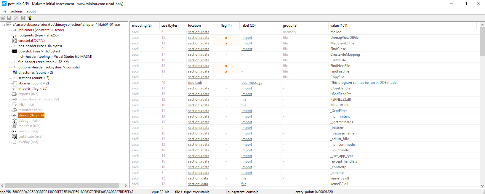
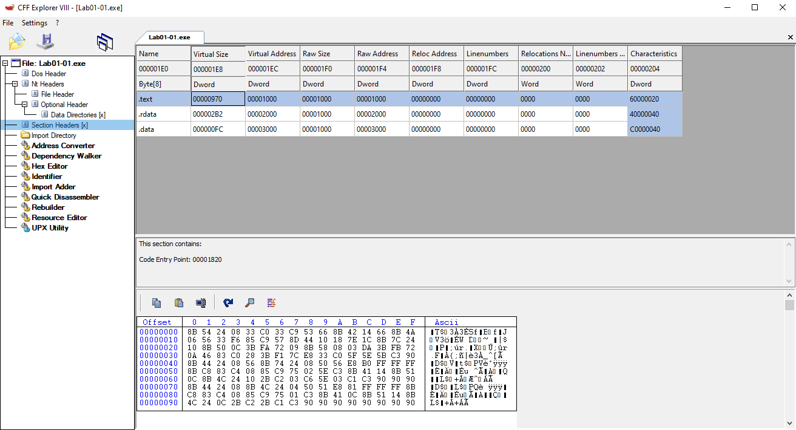
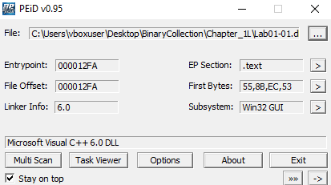
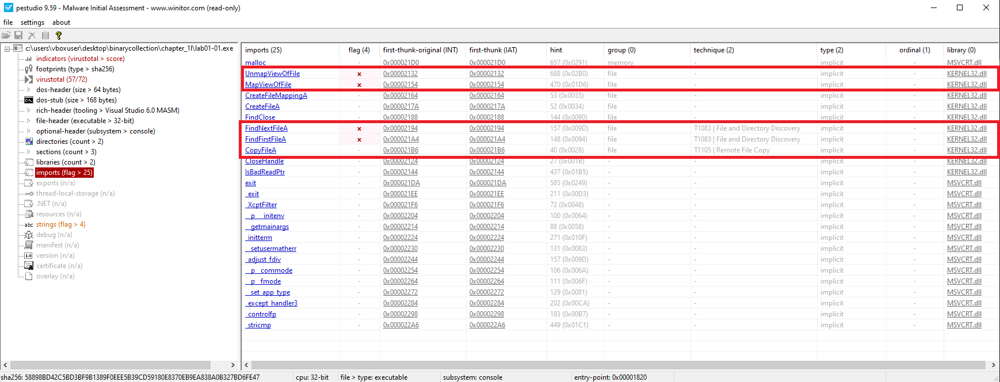
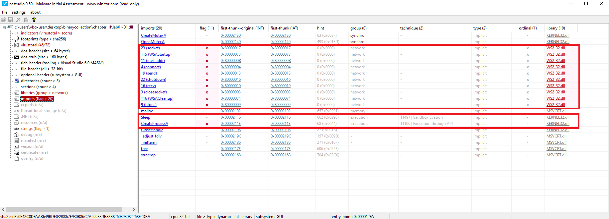
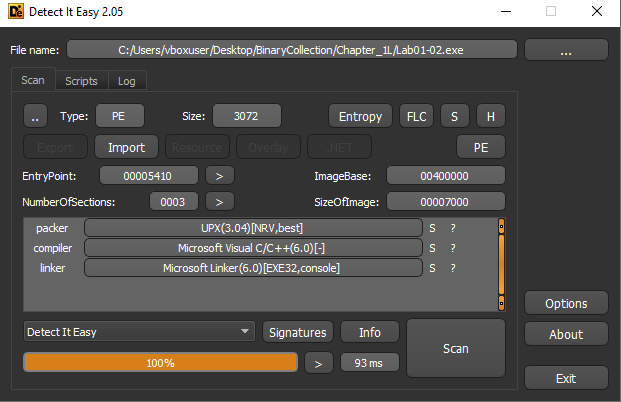
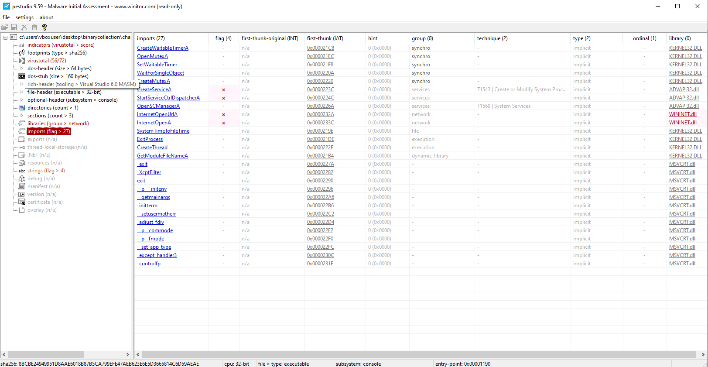
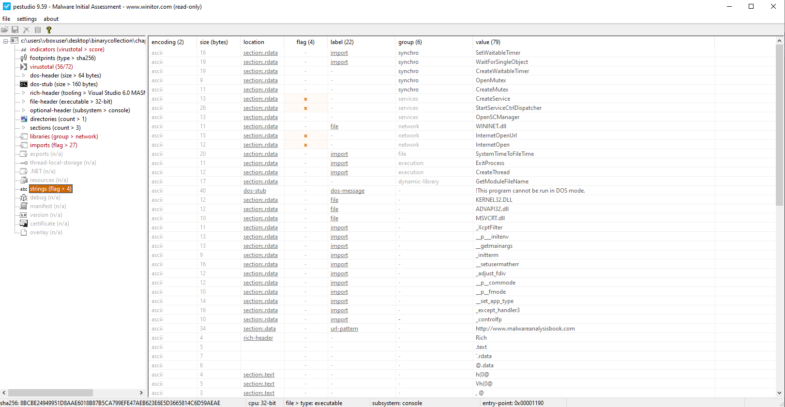

_Chapter 1_

---

##  _Lab 1-1_

### 📝 Summary
In this lab, we analyze `Lab01-01.exe` and `Lab01-01.dll` using static analysis techniques.  
Our goal is to identify suspicious characteristics, determine the purpose of the files, and extract any host-based or network-based indicators.  
We use tools such as **PE Studio**, **PEiD**, **PEview**, **Strings**, **Dependency Walker**, **Detect It Easy**, and **VirusTotal**.

---

### 📍 Question 1: VirusTotal Detections

**Do either files match any existing antivirus signatures?**

#### 🟩 `Lab01-01.exe`


- **Detection Ratio:** `56 / 71`
- **Common AV Detections:**
  - `CrowdStrike Falcon`: *Win/malicious_confidence_100%*
  - `AVG`: *Win32:MalwareX-gen*

#### 🟨 `Lab01-01.dll`


- **Detection Ratio:** `46 / 72`
- **Common AV Detections:**
  - `AVG`: *Win32:Malware-gen*
  - `Bitdefender`: *Gen:Variant.Doina.76618*

---

### 📍 Question 2: Compilation Timestamps

**When were these files compiled?**

| File            | Compilation Time (UTC)          |
|-----------------|----------------------------------|
| `Lab01-01.exe`  | Sun Dec 19 16:16:19 2010         |
| `Lab01-01.dll`  | Sun Dec 19 16:16:38 2010         |




---

### 📍 Question 3: Packed or Obfuscated?

**Are there any indications that either file is packed or obfuscated?**

#### 🟩 `Lab01-01.exe`
- PEiD identifies compiler as **Microsoft Visual C++ 6.0**
- Strings are clearly visible
- Normal entropy values
- Standard section names like `.text`, `.data`, `.rdata`
- Virtual size ≈ Raw size






#### 🟨 `Lab01-01.dll`
Same characteristics as above:




> **Conclusion:** There is no indication that these files are packed or obfuscated.

---

### 📍 Question 4: Suspicious Imports

**Do any imports hint at what this malware does?**

#### 🟩 `Lab01-01.exe`


**Key Imports:**
- `CopyFileA`
- `FindFirstFileA()`
- `FindNextFileA()`

> Indicates file enumeration and manipulation functionality.

#### 🟨 `Lab01-01.dll`


**Key Imports:**
- `CreateMutexA()` – ensures single instance
- `CreateProcessA()` – spawns new processes
- `Sleep()` – possible anti-analysis
- `WSAStartup()`, `socket()`, `connect()` – network communication (C2)

---

### 📍 Question 5: Host-Based Indicators

**Are there any files or artifacts to look for on infected systems?**

#### 🟩 `Lab01-01.exe`


> Possible copied path: `C:\windows\system32\kerne132.dll`

#### 🟨 `Lab01-01.dll`


> Hardcoded IP address: `127.26.152.13`

---

### 📍 Question 6: Network-Based Indicators

**What network-based indicators could be used to detect this malware?**

#### 🟩 `Lab01-01.exe`
> No observed network indicators

#### 🟨 `Lab01-01.dll`


> Connects to: `127.26.152.13`

---

### 📍 Question 7: Purpose of the Files

**What is the suspected purpose of these files?**

#### 🟩 `Lab01-01.exe`
> Its purpose is to deploy and execute the malicious DLL on the system, potentially copying it to the System32 directory for persistence.

#### 🟨 `Lab01-01.dll`
> Its purpose is to function as a backdoor or Remote Access Trojan (RAT) — enabling file system access and communication with a C2 server.

---
---

##  _Lab 1-2_
### 📝 Summary

In this lab, we analyze `Lab01-02.exe` using static analysis techniques.
Our goal is to identify suspicious characteristics, understand the program’s functionality, and extract any host-based or network-based indicators of compromise (IOCs).

---

### 📍 Question 1: VirusTotal Detections
#### 🟥 `Lab01-02.exe`

**Does `Lab01-02.exe` match any known antivirus signatures?**


- **Detection Ratio:** `59 / 72`
- **Common AV Detections:**
  - `Avast`: *Win32:Malware-gen*
  - `AVG`: *Win32:Malware-gen*

---

### 📍 Question 2: Packed or Obfuscated?
#### 🟥 `Lab01-02.exe`

**Are there any indications that this file is packed or obfuscated? If so, what are these indicators? If the file is packed, unpack it if possible.**



- **Packing Detected:**  
  Using **Detect It Easy**, the file is identified as packed with **UPX (Ultimate Packer for eXecutables)**.


- **Supporting Indicators:**
  - Sections named **UPX0** and **UPX1**
  - A large difference between **Virtual Size** and **Raw Size**
  - Very limited imported functions (typical of UPX-packed binaries)
  - No visible readable strings in the initial state


```bash
# Unpack Lab with UPX
upx -d Lab01-02.exe -o Unpacked.exe
```
---

### 📍 Question 3: Suspicious Imports
#### 🟥 `Lab01-02.exe`

**Do any imports hint at this program’s functionality? If so, which imports are they and what do they tell you?**


**Key Imports (WININET.DLL):**
- `InternetOpen()`
- `InternetOpenUrl()`

> Indicates potential network communication, such as downloading payloads or contacting a C2 server.

**Key Imports (ADVAPI32.DLL):**
- `OpenSCManager()`
- `CreateService()`
- `StartServiceCtrlDispatcher()`

> Indicates service creation for persistence, allowing the malware to run as a Windows Service.

--- 

### 📍 Question 4: Network-Based Indicators
#### 🟥 `Lab01-02.exe`

**What host- or network-based indicators could be used to identify this malware on infected machines?**


> Connects to: `http://www.malwareanalysisbook.com`

---
---

##  _Lab 1-3_
### 📝 Summary

In this lab, we analyze `Lab01-03.exe` using static analysis techniques.
Our goal is to identify suspicious characteristics, understand the program’s functionality, and extract any host-based or network-based indicators of compromise (IOCs).

---

### 📍 Question 1: VirusTotal Detections
#### 🟦 `Lab01-03.exe`

**Does `Lab01-03.exe` match any known antivirus signatures?**


- **Detection Ratio:** `66 / 72`
- **Common AV Detections:**
  - `Avast`: *Win32:Evo-gen [Trj]*
  - `AVG`: *Win32:Evo-gen [Trj]*

---

### 📍 Question 2: Packed or Obfuscated?
#### 🟦 `Lab01-03.exe`

**Are there any indications that this file is packed or obfuscated? If so, what are these indicators? If the file is packed, unpack it if possible.**


- **Packing Detected:**  
  Using **Detect It Easy**, the file is identified as packed with **FSG (Fast Small Good)** packer.


- **Supporting Indicators:**
  - Sections unnamed
  - A large difference between **Virtual Size** and **Raw Size**
  - Very limited imported functions (typical of FSG-packed binaries)
  - No visible readable strings in the initial state

> *we can't unpack this file* 


---

### 📍 Question 3: Suspicious Imports
#### 🟦 `Lab01-03.exe`

**Do any imports hint at this program’s functionality? If so, which imports are they and what do they tell you?**


> ⚠️ **Note:** To fully analyze suspicious imports, the file must be unpacked.  
> With the techniques learned so far, we are unable to **unpack FSG**. 

--- 

### 📍 Question 4: Network-Based Indicators

#### 🟦 `Lab01-03.exe`

**What host- or network-based indicators could be used to identify this malware on infected machines?**


##  _Lab 1-4_
### 📝 Summary

In this lab, we analyze Lab01-04.exe using static analysis techniques.
Our goal is to determine whether the file is packed or obfuscated, identify its compilation details, and examine its imports to understand the program’s potential functionality.
We also aim to extract host-based and network-based indicators of compromise (IOCs) and inspect the resource section for any hidden or embedded components.

---

### 📍 Question 1: VirusTotal Detections
#### 🟪 `Lab01-04.exe`

**Does `Lab01-04.exe` match any known antivirus signatures?**


- **Detection Ratio:** `66 / 72`
- **Common AV Detections:**
  - `Avast`: *Win32:Evo-gen [Trj]*
  - `AVG`: *Win32:Evo-gen [Trj]*

---


