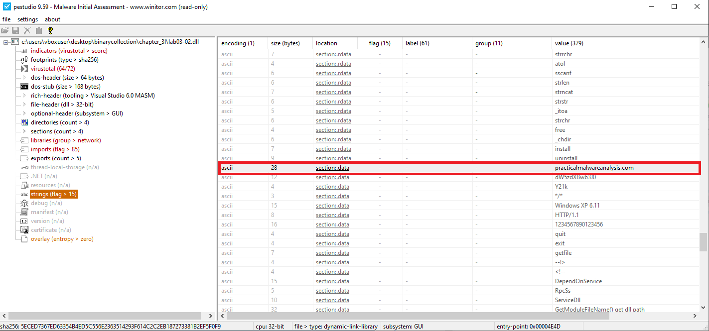

<style>
img {
  border: 0px solid transparent;
  height: auto;
}

img:hover {
  transform: scale(1.2);
  border: 2px solid #007bff; /* Blue border on hover */
  border-radius: 10px;
}
</style>


##  _Lab 1-1_

### 📝 Summary
In this lab, we analyze `Lab01-01.exe` and `Lab01-01.dll` using static analysis techniques.  
Our goal is to identify suspicious characteristics, determine the purpose of the files, and extract any host-based or network-based indicators.  
We use tools such as **PE Studio**, **PEiD**, **PEview**, **Strings**, **Dependency Walker**, **Detect It Easy**, and **VirusTotal**.

---

### 📍 Question 1: VirusTotal Detections

> **Do either files match any existing antivirus signatures?**
{: .prompt-tip }

#### 🟩 `Lab01-01.exe`


- **Detection Ratio:** `56 / 71`
- **Common AV Detections:**
  - `CrowdStrike Falcon`: *Win/malicious_confidence_100%*
  - `AVG`: *Win32:MalwareX-gen*

#### 🟨 `Lab01-01.dll`


- **Detection Ratio:** `46 / 72`
- **Common AV Detections:**
  - `AVG`: *Win32:Malware-gen*
  - `Bitdefender`: *Gen:Variant.Doina.76618*

---

### 📍 Question 2: Compilation Timestamps

> **When were these files compiled?**
{: .prompt-tip }

#### 🟩 `Lab01-01.exe`


#### 🟨 `Lab01-01.dll`


| File            | Compilation Time (UTC)          |
|-----------------|----------------------------------|
| `Lab01-01.exe`  | Sun Dec 19 16:16:19 2010         |
| `Lab01-01.dll`  | Sun Dec 19 16:16:38 2010         |

---

### 📍 Question 3: Packed or Obfuscated?

> **Are there any indications that either file is packed or obfuscated?**
{: .prompt-tip }

#### 🟩 `Lab01-01.exe`
- PEiD identifies compiler as **Microsoft Visual C++ 6.0**
- Strings are clearly visible
- Normal entropy values
- Standard section names like `.text`, `.data`, `.rdata`
- Virtual size ≈ Raw size


#### 🟨 `Lab01-01.dll`
Same characteristics as above:


> **Conclusion:** There is no indication that these files are packed or obfuscated.

---

### 📍 Question 4: Suspicious Imports

> **Do any imports hint at what this malware does?**
{: .prompt-tip }

#### 🟩 `Lab01-01.exe`


**Key Imports (KERNEL32.DLL):**
- `CopyFileA`
- `FindFirstFileA()`
- `FindNextFileA()`

> Indicates file enumeration and manipulation functionality.

#### 🟨 `Lab01-01.dll`


**Key Imports (KERNEL32.DLL):**
- `CreateMutexA()` – ensures single instance
- `CreateProcessA()` – spawns new processes
- `Sleep()` – possible anti-analysis

**Key Imports (WS2_32.DLL):**
- `WSAStartup()`, `socket()`, `connect()` – network communication (C2)

---

### 📍 Question 5: Host-Based Indicators

> **Are there any files or artifacts to look for on infected systems?**
{: .prompt-tip }

#### 🟩 `Lab01-01.exe`


> Possible copied path: `C:\windows\system32\kerne132.dll`

#### 🟨 `Lab01-01.dll`


> Hardcoded IP address: `127.26.152.13`

---

### 📍 Question 6: Network-Based Indicators

> **What network-based indicators could be used to detect this malware?**
{: .prompt-tip }

#### 🟩 `Lab01-01.exe`
> No observed network indicators

#### 🟨 `Lab01-01.dll`


> Connects to: `127.26.152.13`

---

### 📍 Question 7: Purpose of the Files

> **What is the suspected purpose of these files?**
{: .prompt-tip }

#### 🟩 `Lab01-01.exe`
> Its purpose is to deploy and execute the malicious DLL on the system, potentially copying it to the System32 directory for persistence.

#### 🟨 `Lab01-01.dll`
> Its purpose is to function as a backdoor or Remote Access Trojan (RAT) — enabling file system access and communication with a C2 server.

---
---

##  _Lab 1-2_
### 📝 Summary

In this lab, we analyze `Lab01-02.exe` using static analysis techniques.
Our goal is to identify suspicious characteristics, understand the program’s functionality, and extract any host-based or network-based indicators of compromise (IOCs).

---

### 📍 Question 1: VirusTotal Detections
#### 🟥 `Lab01-02.exe`

> **Does Lab01-02.exe match any known antivirus signatures?**
{: .prompt-tip }


- **Detection Ratio:** `59 / 72`
- **Common AV Detections:**
  - `Avast`: *Win32:Malware-gen*
  - `AVG`: *Win32:Malware-gen*

---

### 📍 Question 2: Packed or Obfuscated?
#### 🟥 `Lab01-02.exe`

> **Are there any indications that this file is packed or obfuscated? If so, what are these indicators? If the file is packed, unpack it if possible.**
{: .prompt-tip }


- **Packing Detected:**  
  Using **Detect It Easy**, the file is identified as packed with **UPX (Ultimate Packer for eXecutables)**.


- **Supporting Indicators:**
  - Sections named **UPX0** and **UPX1**
  - A large difference between **Virtual Size** and **Raw Size**
  - Very limited imported functions (typical of UPX-packed binaries)
  - No visible readable strings in the initial state


```bash
# Unpack Lab with UPX
upx -d Lab01-02.exe -o Unpacked.exe
```
---

### 📍 Question 3: Suspicious Imports
#### 🟥 `Lab01-02.exe`

> **Do any imports hint at this program’s functionality? If so, which imports are they and what do they tell you?**
{: .prompt-tip }


**Key Imports (WININET.DLL):**
- `InternetOpen()`
- `InternetOpenUrl()`

> These functions suggest the program may perform **network communications**, such as retrieving data from the internet, downloading additional payloads, or connecting to a **command-and-control (C2) server**.

**Key Imports (ADVAPI32.DLL):**
- `OpenSCManager()`
- `CreateService()`
- `StartServiceCtrlDispatcher()`

> These indicate functionality to create and manage **Windows services**, a common persistence mechanism that allows the malware to **automatically run at system startup** under elevated privileges.

--- 

### 📍 Question 4: Network-Based Indicators
#### 🟥 `Lab01-02.exe`

> **What host- or network-based indicators could be used to identify this malware on infected machines?**
{: .prompt-tip }


> Connects to: `http://www.malwareanalysisbook.com`

---
---

##  _Lab 1-3_
### 📝 Summary

In this lab, we analyze `Lab01-03.exe` using static analysis techniques.
Our goal is to identify suspicious characteristics, understand the program’s functionality, and extract any host-based or network-based indicators of compromise (IOCs).

---

### 📍 Question 1: VirusTotal Detections
#### 🟦 `Lab01-03.exe`

> **Does Lab01-03.exe match any known antivirus signatures?**
{: .prompt-tip }


- **Detection Ratio:** `66 / 72`
- **Common AV Detections:**
  - `Avast`: *Win32:Evo-gen [Trj]*
  - `AVG`: *Win32:Evo-gen [Trj]*

---

### 📍 Question 2: Packed or Obfuscated?
#### 🟦 `Lab01-03.exe`

> **Are there any indications that this file is packed or obfuscated? If so, what are these indicators? If the file is packed, unpack it if possible.**
{: .prompt-tip }


- **Packing Detected:**  
  Using **Detect It Easy**, the file is identified as packed with **FSG (Fast Small Good)** packer.


- **Supporting Indicators:**
  - Sections unnamed
  - A large difference between **Virtual Size** and **Raw Size**
  - Very limited imported functions (typical of FSG-packed binaries)
  - No visible readable strings in the initial state

> *we can't unpack this file* 


---

### 📍 Question 3: Suspicious Imports
#### 🟦 `Lab01-03.exe`

> **Do any imports hint at this program’s functionality? If so, which imports are they and what do they tell you?**
{: .prompt-tip }

> ⚠️ **Note:** To fully analyze suspicious imports, the file must be unpacked.  
> With the techniques learned so far, we are unable to **unpack FSG**. 

--- 

### 📍 Question 4: Network-Based Indicators

#### 🟦 `Lab01-03.exe`

> **What host- or network-based indicators could be used to identify this malware on infected machines?**
{: .prompt-tip }


##  _Lab 1-4_
### 📝 Summary

In this lab, we analyze `Lab01-04.exe` using static analysis techniques.
Our goal is to determine whether the file is packed or obfuscated, identify its compilation details, and examine its imports to understand the program’s potential functionality.
We also aim to extract host-based and network-based indicators of compromise (IOCs) and inspect the resource section for any hidden or embedded components.

---

### 📍 Question 1: VirusTotal Detections
#### 🟪 `Lab01-04.exe`

> **Does Lab01-04.exe match any known antivirus signatures?**
{: .prompt-tip }


- **Detection Ratio:** `63 / 72`
- **Common AV Detections:**
  - `Avira`: *TR/Dropper.Gen*
  - `AVG`: *Win32:MalwareX-gen [Drp]*

---

### 📍 Question 2: Packed or Obfuscated?
#### 🟪 `Lab01-04.exe`

>**Are there any indications that this file is packed or obfuscated? If so, what are these indicators? If the file is packed, unpack it if possible.**
{: .prompt-tip }

> Not Packed

---

### 📍 Question 3: compilation date?
#### 🟪 `Lab01-04.exe`

> **When was this program compiled?**
{: .prompt-tip }


| File            | Compilation Time (UTC)          |
|-----------------|----------------------------------|
| `Lab01-01.exe`  | Fri Aug 30 22:26:59 2019         |


---


### 📍 Question 4: Suspicious Imports
#### 🟪 `Lab01-04.exe`

> **Do any imports hint at this program’s functionality? If so, which imports are they and what do they tell you?**  
{: .prompt-tip }


**Key Imports (ADVAPI32.DLL):**
- `OpenProcessToken`
- `LookupPrivilegeValueA`
- `AdjustTokenPrivileges`

> Indicates **access token manipulation** for privilege escalation, possibly enabling `SeDebugPrivilege` to interact with other processes.

**Key Imports (KERNEL32.DLL):**
- `CreateFileA`
- `WriteFile`
- `MoveFileA`
- `GetTempPathA`

> Suggests file manipulation capabilities such as creating, writing, moving files, and using temporary paths—often used for staging malicious payloads.

**Key Imports (KERNEL32.DLL):**
- `WinExec`
- `CreateRemoteThread`
- `OpenProcess`

> Points to possible **code execution** and **process injection** into other running processes.

**Key Imports (KERNEL32.DLL):**
- `LoadLibraryA`
- `GetProcAddress`
- `GetModuleHandleA`

> Enables dynamic loading and resolution of APIs or DLLs—commonly used to evade static detection and load payloads at runtime.

---

### 📍 Question 5: Network-Based Indicators
#### 🟪 `Lab01-04.exe`

> **What host-based or network-based indicators could be used to identify this malware on infected machines?**
{: .prompt-tip }


**Network-Based Indicators:**
- **Hardcoded URL:** `http://www.malwareanalysisbook.com/updater.exe`  
  > Suggests the malware attempts to **download additional payloads** or check in for updates. This is a high-fidelity indicator for network detection.  
- **Domain:** `www.malwareanalysisbook.com`

**Host-Based Indicators:**
- **Host-based:** `\system32\wupdmgrd.exe` `\winup.exe`

---

### 📍 Question 6: Resources
#### 🟪 `Lab01-04.exe`

> **This file has one resource in the resource section. Use Resource Hacker to examine that resource, and then use it to extract the resource. What can you learn from the resource?**
{: .prompt-tip }

**Steps Performed:**


1. **Opened the sample in Resource Hacker**
   - Navigated to `.rsrc` → `RCDATA` → `101` → `1033`.
   - Observed that the resource’s binary data begins with `4D 5A` (**MZ header**), confirming it is an **embedded executable**.

2. **Extracted the resource**
   - Right-clicked `1033` → **Save Resource to a bin file** → saved it as `bin101.bin`.


3. **Inspected the extracted file in CFF Explorer**
   - Loaded `bin101.bin` in **CFF Explorer** and checked the **Import Directory**.
   - Found these key imports:
     - `KERNEL32.DLL`
     - `URLMON.DLL → URLDownloadToFileA`


---

<div style="text-align: center;">
  
  <p style="font-weight: bold; font-size: 1.2em; margin-top: 0.5em;">Finally finished Chapter One</p>
</div>

---

##  _Lab 3-1_
⚠️ **Note:**  
 To properly analyze these labs (3-1 to 3-4), it's essential to run the samples on **Windows XP**.  
 If executed on **Windows 10**, the malware will **terminate immediately** without exhibiting its intended behavior.  
 All analysis in this series is conducted using **Windows XP** to ensure accurate observation of malware activities.

### 📝 Summary

Lab03-01.exe is a very small, intentionally simple piece of malware used to practice basic dynamic analysis. Its observable behavior is limited; it performs minimal actions but does establish network activity and can be profiled to extract host- and network-based indicators.


### 📍 Question 1: Suspicious Imports and Strings
#### ⬜ `Lab03-01.exe`

> **What are this malware’s imports and strings?**
{: .prompt-tip }

**Imports**

> The static import table is extremely minimal: the only *statically* resolved import is `ExitProcess` from `kernel32.dll`, which is a hallmark of packing/obfuscation—most meaningful functionality is resolved or loaded at runtime. This forces the analyst to rely on dynamic analysis to see the real behavior.  

**Strings**

> Despite the sparse import table, the binary contains readable strings that hint at network activity, environment checking, and potential persistence or anti-analysis techniques. Notable strings include:  

- **Interesting Strings:**
  - `CONNECT %s: %i HTTP/1.0\r\n\r\n` → indicates potential plain HTTP beacons
  - `www.practicalmalwareanalysis.com` → PMA domain
  - `ws2_32.dll` → confirms Winsock usage for network comms
  
  - Registry references:
    - `SOFTWARE\Microsoft\Windows\CurrentVersion\Run`
    - `SOFTWARE\Microsoft\Windows\CurrentVersion\Explorer\Shell Folders`
    - `Software\Microsoft\Active Setup\Installed Components`


*Process Monitor*

*Process Explorer*


*Registry Editor*

Using **Procmon**, we identified the following registry behavior:

- **HKLM\SOFTWARE\Microsoft\Windows\CurrentVersion\Run**
  - Standard Windows auto-start location.

- **HKLM\SOFTWARE\Microsoft\Windows\CurrentVersion\Run\VideoDriver**
  - A new value was written with the following data:


---

### 📍 Question 2: host-based indicators
#### ⬜ `Lab03-01.exe`

> 1. **What are the malware’s host-based indicators?**
{: .prompt-tip }


- **Registry keys of interest:**

- **HKLM\SOFTWARE\Microsoft\Windows\CurrentVersion\Run**
  - This registry hive is commonly abused by malware for establishing persistence. It ensures malicious code is launched automatically at every system startup.
  

- **HKLM\SOFTWARE\Microsoft\Windows\CurrentVersion\Run\VideoDriver**
  - The malware sets the value of this subkey to point to the dropped executable.


- A **Mutex** is created: `"WinVMX32"`  
  > This mutual exclusion object acts as a lock, likely used to prevent multiple instances of the malware from running simultaneously.

- The malware copies itself to:  
  `C:\Windows\System32\vmx32to64.exe`


---

### 📍 Question 3: Netwwork-based indicators
#### ⬜ `Lab03-01.exe`

> 2. **Are there any useful network-based signatures for this malware? If so, what are they?**
{: .prompt-tip }


Yes. The following network-based signatures are useful for detection:
> DNS resolution of `www.practicalmalwareanalysis.com`.
  Outbound http traffic.

---

##  _Lab 3-2_
### 📝 Summary
Lab03-02.dll is a malware sample analyzed for its behavior and characteristics. It exhibits stealthy behavior, attempting to avoid detection by using various obfuscation techniques. The dynamic analysis revealed its capability to inject malicious code into legitimate processes, potentially allowing it to evade traditional antivirus detection. This behavior highlights its advanced nature compared to simpler malware samples.

---

### 📍 Question 1: Installation 
#### 🟫 Lab03-02.dll

> **How can you get this malware to install itself?**
{: .prompt-tip }


*PE Studio*

- **Registry Manipulation (ADVAPI32.dll)**

`RegSetValueExA`  
`RegCreateKeyA`  
> Modify or add registry keys for **persistence** or **configuration changes**.  

- **Service Control (ADVAPI32.dll)**

`CreateServiceA`, `OpenServiceA`, `OpenSCManagerA`, `CloseServiceHandle`, `SetServiceStatus`  
> Creates or interacts with Windows services – often abused for persistence or privilege escalation.  

`DeleteService`  
> May attempt to remove or disable services. 

- **High-level (WININET.dll):**

`InternetOpenA`, `InternetConnectA`, `InternetReadFile`, `InternetCloseHandle`, `HttpOpenRequestA`, `HttpSendRequestA`, `HttpQueryInfoA`  
> Indicates HTTP/S communication — **C2**, or **data exfiltration**.  


- **Low-level (WS2_32.dll):**

`WSASocketA`, `connect`, `send`, `recv`, `closesocket`, `select`, `shutdown`, `inet_addr`, `WSAStartup`, `WSACleanup`, `ioctlsocket`, `__WSAFDIsSet`, `htons`, `gethostvalue`  

> Suggests use of **custom TCP sockets** – often seen in malware with its own networking stack.  


*CFF Explorer*

These functions are likely tied to **Windows service manipulation**:
- `Install` and `ServiceMain` are typical for service initialization.
- `UninstallService` suggests cleanup logic.
- `installA` / `uninstallA` might be ASCII variants or aliases.

```bash
rundll32.exe Lab03-02.dll,install
```

---

### 📍 Question 2: Persistence I
#### 🟫 Lab03-02.dll
**How would you get this malware to run after installation?**
{: .prompt-tip }


*Process Monitor*
- **Registry Activity**  
  The following registry-related API calls were captured during execution of the malware:

  - `RegOpenKey`  
    > Key: `HKLM\SOFTWARE\Microsoft\Windows NT\CurrentVersion\Svchost`

  - `RegQueryValue`  
    > Key: `HKLM\SOFTWARE\Microsoft\Windows NT\CurrentVersion\Svchost\netsvcs`


*Registry Editor*

The malware installs itself as a **Windows service** with the name **`IPRIP`**.  

To manually run the service after installation, you can use either of the following methods:

```shell
sc start IPRIP
```

--

### 📍 Question 3: Persistence II
#### 🟫 Lab03-02.dll
> **How would you get this malware to run after installation?**
{: .prompt-tip }

By searching for the specified DLL (`Lab03-02.dll`) or examining the DLLs loaded by processes in **Process Explorer**, we can identify the **process ID (PID) of the `svchost.exe` instance** hosting the malicious service (`IPRIP`).  


*jai minton screenshot*
- **PID: 1068**


---

### 📍 Question 4: procmon filter
#### 🟫 Lab03-02.dll
> 4. **Which filters could you set in order to use procmon to glean information?**
{: .prompt-tip }
Because there’s likely to be multiple svchost processes, we can filter by the Process ID to glean information only on the svchost process responsible for running this malware.

---

### 📍 Question 5: host-based indicators
#### 🟫 Lab03-02.dll
5. **What are the malware’s host-based indicators?**


*Registry Editor*

- A malicious service is created with the name **`IPRIP`**.  
- Service description observed: **Intranet Network Awareness (INA+)**  
  - *Depends on INA+*  
  - *Collects and stores network configuration and location information, and notifies applications when this information changes.*  
- Registry entry for the service DLL: 


### 📍 Question 6: network-based indicators
#### 🟫 Lab03-02.dll
> 6. **Are there any useful network-based signatures for this malware?**
{: .prompt-tip }


*PEStudio*

**Observed Network Activity**
- During static analysis in **PEStudio**, the malware was found to attempt a connection to the following domain: `practicalmalwareanalysis.com` .

---


##  _Lab 3-3_
### 📝 Summary

The malware `Lab03-03.exe` is a dropper that uses a common stealth technique known as **process hollowing** (or process replacement). It works by launching a legitimate Windows process, `svchost.exe`, in a suspended state. It then overwrites the memory of this new process with its own malicious code before finally resuming its execution.

This allows the malware's core logic, including its **network communication**, to run under the guise of a **trusted system process**, making it significantly harder to detect.

---

### 📍 Question 1: Process Behavior
#### 🟧 Lab03-03.exe

> **What do you notice when monitoring this malware with Process Explorer?**
{: .prompt-tip }
When you run `Lab03-03.exe`, its behavior is a classic giveaway:


*Process Explorer*

- It appears in **Process Explorer** for only a brief moment before terminating.
- It immediately spawns a new instance of `svchost.exe` as a child process.
- The parent process, `Lab03-03.exe`, then exits, leaving the `svchost.exe` process running without a parent.

> This "launch-and-terminate" behavior is **highly suspicious**. It's a textbook indicator of a process injector, whose sole purpose is to load malware into another process and then disappear.
{: .prompt-warning }

---

### 📍 Question 2: Memory Modification
#### 🟧 Lab03-03.exe

> **Can you identify any live memory modifications?**
{: .prompt-tip }
Yes, live memory modifications are clearly visible. The `svchost.exe` process created by the malware is a hollowed-out version of the legitimate system process.


*Process Explorer*

You can confirm this using **Process Explorer**:
1.  Right-click the suspicious `svchost.exe` process and select **Properties**.
2.  Navigate to the **Strings** tab.

You will find strings that do **not** belong in a legitimate `svchost.exe` instance, such as:

- `practicalmalwareanalysis.com`
- `\svchost.exe`

> These strings are definitive proof that the memory of `svchost.exe` was overwritten with malicious code.
> {: .prompt-info }

---

### 📍 Question 3: Host-Based Indicators
#### 🟧 Lab03-03.exe

> **What are the malware’s host-based indicators?**
{: .prompt-tip }


*Screen shot*
- The malware creates the log file practicalmalwareanalysis.log.


---


### 📍 Question 4:
#### 🟧 Lab03-03.exe
> **What is the malware's purpose?**
{: .prompt-tip}

By typing in an application like WordPad and then examining the file `practicalmalwareanalysis.log`, we can see that the malware has logged all of our keystrokes.

The program's primary purpose is to function as a **stealthy keylogger**. A keylogger's goal is to **steal sensitive information** like usernames, passwords, and financial details by secretly recording everything a user types.

The malware achieves this by injecting its keylogging payload into the `svchost.exe` process, effectively hiding its malicious activity within a trusted system process.

---


##  _Lab 3-4_

### 📝 Summary  

**Lab03-04.exe** is a multi-stage dropper/backdoor that uses a simple **anti-analysis check**.  
It searches for a specific file (`C:\WINDOWS\system32\wuamgrd.exe`) and **exits silently** if the file is not present.  

On a clean sandbox the process appears to start and then terminates within milliseconds, leaving **no files, no registry changes, and no network activity**. The sample only proceeds to its backdoor behavior when its environmental check is satisfied.

---

### 📍 Question 1: Initial Behavior  
#### 🟩 Lab03-04.exe  

> **What happens when you run this file?**  
{: .prompt-tip}


*ProcMon*
*(ProcMon shows the full command-line used to delete the original binary, redirected to NUL.)*

When executed in a clean analysis VM or sandbox:

- The process launches and then **immediately terminates** (appears for a fraction of a second).
- No files are written, no registry keys are modified.

> This silent exit indicates an **early environment check** designed to hide malicious behavior in automated environments.

---

### 📍 Question 2: The Roadblock  
#### 🟩 Lab03-04.exe  

> **What is causing the roadblock in dynamic analysis?**  
{: .prompt-tip}


*PEStudio*

Among the strings, we find:  
- A domain name reference  
- The registry path `SOFTWARE\Microsoft\XPS`  
- Keywords such as `DOWNLOAD`, `UPLOAD`  
- The presence of `HTTP/1.0`

These indicators strongly suggest the sample functions as an **HTTP-based backdoor**. It is likely capable of **communicating with a remote server**, performing file transfers, and maintaining persistence through registry modifications.  

---

### 📍 Question 3: Bypassing the Roadblock  
#### 🟩 Lab03-04.exe  

> **Are there other ways to run this program?**  
{: .prompt-tip}

We attempted to exercise alternate code paths by supplying candidate arguments derived from the program strings (for example: `cc`, `re`, `in`). Despite these attempts the sample still spawns `cmd.exe` to issue a delete command and the file is removed during execution.  

At this stage the binary consistently self-cleans and returns no additional observable behavior, so further dynamic exploration is limited. This avenue will be revisited in **Lab 9**, where we'll apply more advanced techniques (memory dumping, debugger-assisted tracing, and controlled network responses) to recover the secondary payload and trigger hidden functionality.

---
---


*yeeaaaaaaaah*