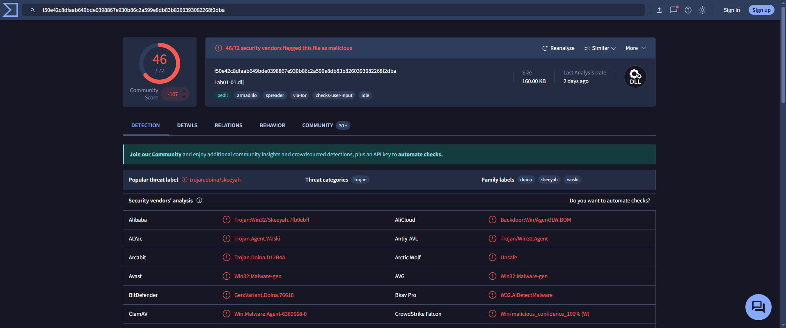

##  _Lab 5-1_

### 📝 Summary
In this lab, we analyze `Lab01-01.exe` and `Lab01-01.dll` using static analysis techniques.  
Our goal is to identify suspicious characteristics, determine the purpose of the files, and extract any host-based or network-based indicators.  
We use tools such as **PE Studio**, **PEiD**, **PEview**, **Strings**, **Dependency Walker**, **Detect It Easy**, and **VirusTotal**.

---

### 📍 Question 1: VirusTotal Detections

**Do either files match any existing antivirus signatures?**

#### ⬛ `Lab05-01.exe`

- **Detection Ratio:** `56 / 71`
- **Common AV Detections:**
  - `CrowdStrike Falcon`: *Win/malicious_confidence_100%*
  - `AVG`: *Win32:MalwareX-gen*

#### 🟨 `Lab01-01.dll`

---

### 📍 Question 2: 

**When were these files compiled?**
