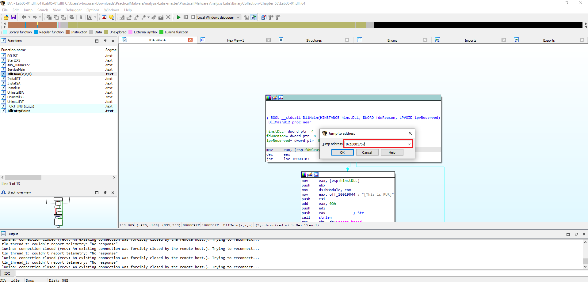
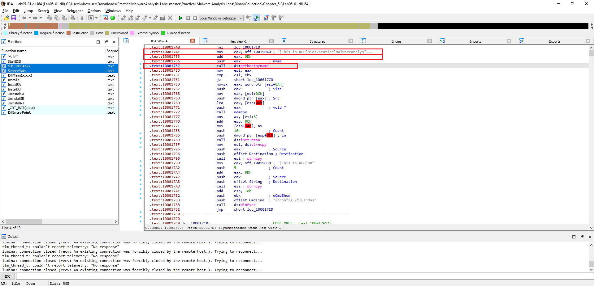
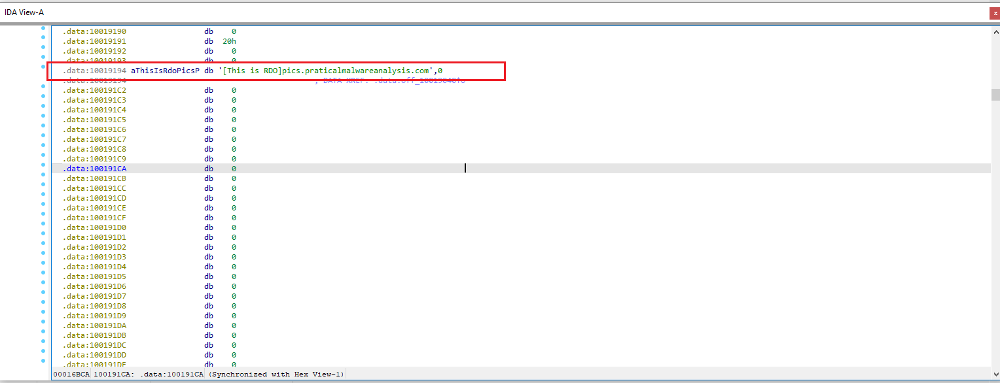
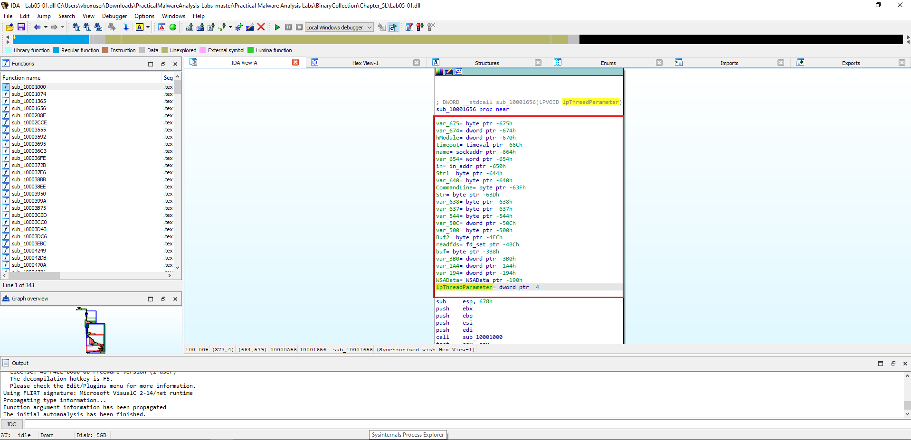
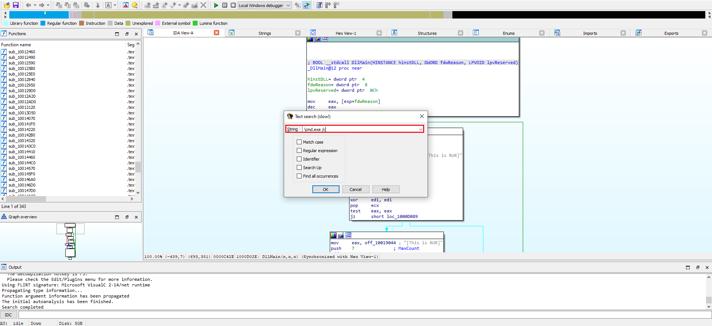
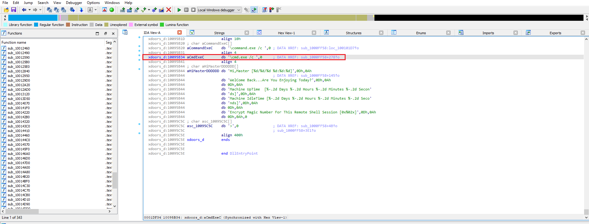
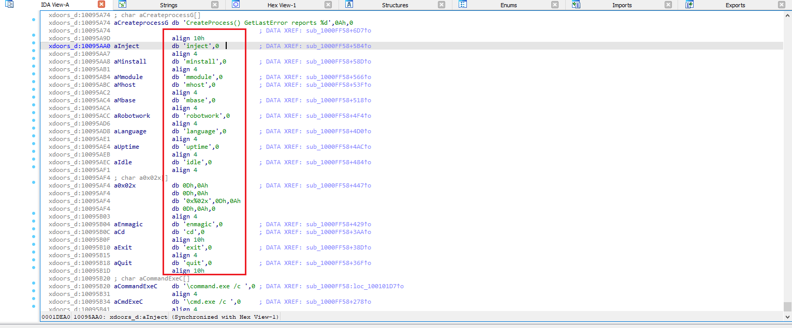
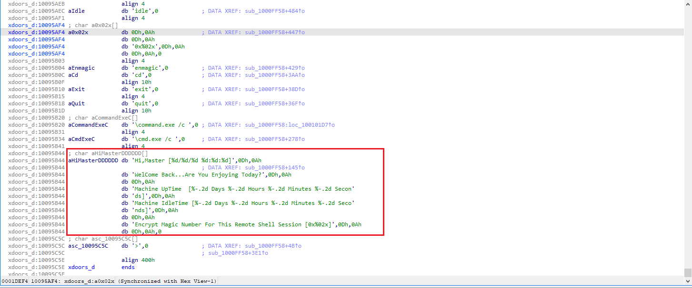

### Toolkit

This lab uses a standard set of tools for advanced static analysis.

| Tool | Type | Purpose | Typical Usage & Notes |
| :--- | :--- | :--- | :--- |
| **PE Studio** | Static | Get a high-level overview of PE headers, imports, and strings. | Excellent for a quick first look to spot suspicious indicators and check for packers. |
| **Detect It Easy**| Static | Identify packers, compilers, and file formats. | Use this early to determine if the sample is obfuscated before diving into disassembly. |
| **Strings** | Static | Extract all printable strings from the binary. | Run `strings -a sample.dll` to find potential IOCs like URLs, file paths, or commands. |
| **IDA Pro / Ghidra**| Static | Disassemble and decompile code for in-depth analysis. | Essential for mapping control flow, understanding function logic, and finding the core malware behavior. |
| **x64dbg** | Dynamic | Debug the malware by stepping through its execution. | Used to observe runtime behavior, inspect memory, and confirm hypotheses from static analysis. |

---

## Lab 5-1

### 📝 Summary

Chapter 5 shifts our focus to **DLL (Dynamic Link Library) malware**. Unlike standalone executables, DLLs are loaded into the address space of other processes, making them a powerful tool for achieving stealth and persistence. Attackers frequently use malicious DLLs for techniques like **DLL injection**, **API hooking**, and creating modular malware.

This lab applies advanced static analysis to `Lab05-01.dll` to determine its functionality without running the code.

---

### 📍 Question 1: DllMain

> **What is the address of DllMain?**
{: .prompt-tip }

The `DllMain` function is located at the address **`0x1000D02E`**.

The **`DllMain`** function is the primary entry point for a DLL. The Windows loader calls it whenever the DLL is loaded into or unloaded from a process. Finding its address is the first and most critical step in analyzing a malicious DLL.

1.  **Load the DLL in IDA Pro**: After loading `Lab05-01.dll`, IDA automatically analyzes the file's structure and identifies its entry point.
2.  **Locate the Function**: You can find `DllMain` in the **Functions window** on the left panel. Since it's the standard entry point for a DLL, IDA correctly names it.
3.  **Identify the Address**: Clicking the function name navigates to the disassembly, where the starting address is displayed.

*ida free*

**A:** `DllMain` is located at **`0x1000D02E`** (function shown as `DllMain@12` in IDA, `.text:1000D02E`).  

> Tip: In IDA the function start address is shown on the left of the disassembly listing (e.g., `.text:1000D02E`), and the function name is shown on the header line (`DllMain@12 proc near`).

---

### 📍 Question 2: imports location

> **Use the Imports window to browse to gethostbyname. Where is the import located?**
{: .prompt-tip }

Only one function calls **`gethostbyname`**

*ida free*

To find out where an imported function is used, you can check its cross-references (often shortened to "xrefs"). This is a powerful feature in IDA Pro that shows every location in the code that refers to a selected function, string, or address.

1.  Navigate to the Function: Go to the Imports window and click on the gethostbyname function, just as in the previous question.
2.  Find Cross-References: With gethostbyname selected, press the X key on your keyboard. This opens the "Cross References" window.
3.  Count the Calls: The window will list every   

---

### 📍 Question 3: How Many Calls?

> **How many functions call gethostbyname?**
{: .prompt-tip }

There are 18 calls to the **`gethostbyname`** function throughout the malware's code.

*ida free*

To determine how many times a function is used, we can check its cross-references (xrefs) in IDA Pro. This feature lists every location in the code that refers to a selected item.

1.  Locate the Function: In the Imports tab, select the gethostbyname function.

2.  Find Cross-References: With the function highlighted, press the (ctrl+X) key or navigate to Jump > Jump to xref This opens the cross-references window.

3.  Count the Calls: The window displays all calls to the function. As shown in the provided image, the bottom of the xrefs window indicates "Line 1 of 18," confirming there are 18 distinct locations in the disassembly that call gethostbyname.

---

### 📍 Question 4: DNS

> **Focusing on the call to gethostbyname located at `0x10001757`, can you figure out which DNS request will be made?**
{: .prompt-tip }

*ida free*
To answer this, I navigated directly to the address **`0x10001757`** in IDA Pro by pressing **`G`** and entering the value.  
This took me straight to the instruction that calls **`ds:gethostbyname`**.

*ida free*

*ida free Graph view*

From there, I traced back the function arguments. In Windows, `gethostbyname` expects a pointer to a hostname string.  
By reviewing the surrounding disassembly, I found that the argument points to the hardcoded string **`pics.praticalmalwareanalysis.com`**.

Right before the call the code adds `0x0D` (hex) to EAX. Converting `0x0D` to decimal gives `13`, so the pointer is advanced `13` bytes — exactly past the prefix `"[This is RDO]"`.

> The malware performs a DNS request for **`pics.praticalmalwareanalysis.com`**.

---

### 📍 Question 5: Local Variables  

> **How many local variables has IDA Pro recognized for the subroutine at `0x10001656`?**  
{: .prompt-tip }

By jumping to **`0x10001656`** in IDA Pro (press **G** and enter the address), we can view the subroutine stack frame.  

IDA identifies **23 local variables** for this function. These are shown with negative stack offsets (e.g., `var_675`, `var_640`, etc.).

 
*ida free Graph view*  

> IDA Pro recognized **23 local variables** for `sub_10001656`.  

---

### 📍 Question 6: Parameters  

> **How many parameters has IDA Pro recognized for the subroutine at `0x10001656`?**  
{: .prompt-tip }

In the same subroutine (`sub_10001656`), parameters are represented by positive stack offsets. IDA identifies a single parameter here:  

- **`lpThreadParameter`** (at offset `+4`)  

> IDA Pro recognized **1 parameter** for `sub_10001656`.

---

### 📍 Question 7: Command String Location 

> **Use the Strings window to locate the string `\cmd.exe /c` in the disassembly. Where is it located?**

*ida free*  

I opened the **Strings** window `(Alt + T)` and searched for the exact sequence `\cmd.exe /c`. The search lands on the data entry at:

*ida free*  
> The string `\cmd.exe /c` is located at `0x10095B34`.

### 📍 Question 8: Code referencing `\cmd.exe /c`

> **What is happening in the area of code that references \cmd.exe /c?**
{: .prompt-tip }

*ida free* 
the code is using the string `cmd.exe /c` to **execute shell** commands on the infected machine.

This functionality effectively creates a **remote shell**, allowing an attacker to run commands on the victim's computer.

- **How It Works**

The command cmd.exe is the Windows Command Prompt. The `/c` switch is an argument that tells `cmd.exe` to execute the command that follows it and then immediately terminate.

In the context of this malware, the program uses `cmd.exe /c` as a prefix to run other commands it receives. For example, if an attacker sends the command `dir`, the malware would construct and execute the full command `cmd.exe /c dir`. This provides a powerful and flexible way for an attacker to control the compromised system. The other strings visible in the screenshots, such as `inject`, `install`, `cd`, and `exit`, are likely commands for this `remote shell`.

*ida free* 

we see several interesting strings that clearly indicate `remote access` and `control capabilities`:

- `aHiMasterDDDDDD`: This string, `Hi, Master [%d/%d %d:%d:%d]\n`, strongly suggests a communication or logging message intended for the attacker (the `Master`). It looks like a greeting that includes a timestamp, which is typical for remote access tools to inform the operator about connection details.

- `Welcome Back...Are You Enjoying Today?`: This is a very informal and personal message, further reinforcing the idea of an interactive session with a human operator.

- `Machine Uptime [%-2d Days %-2d Hours %-2d Minutes %-2d Secon`: This string indicates that the malware is capable of gathering system information, specifically the machine's uptime, and reporting it. This is a common feature in remote administration tools and backdoors.

- `Machine IdleTime [%-2d Days %-2d Hours %-2d Minutes %-2d Seco`: Similar to uptime, this string suggests the malware can report on how long the machine has been idle, which could be useful for an attacker to know when a user is likely not actively using the system.

- `Encrypt Magic Number For This Remote Shell Session [0x002x]\n`: This is a critical piece of information. It explicitly mentions `Remote Shell Session` and `Encrypt Magic Number,` indicating that the communication with the attacker's shell is likely encrypted and uses a specific identifier (magic number).

---
